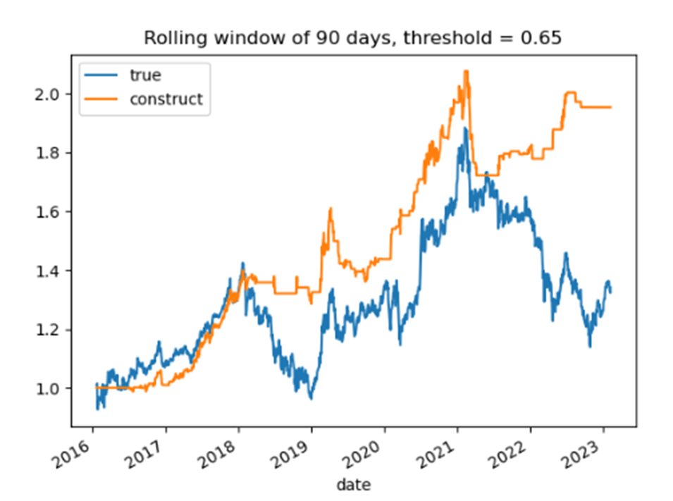
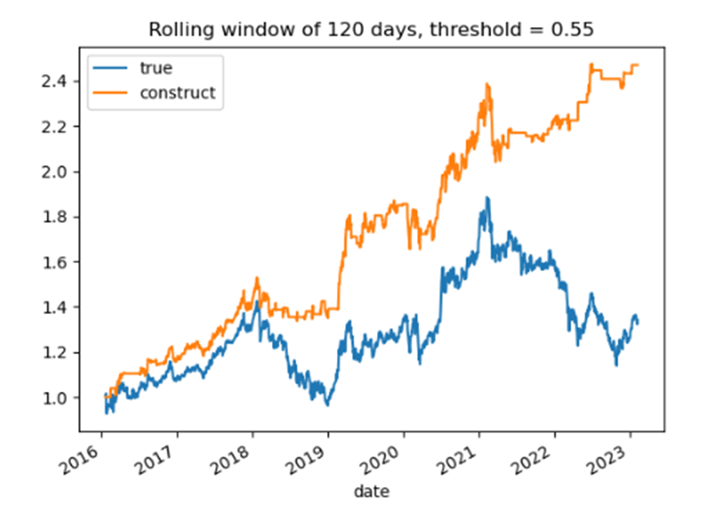

```
研报复现《逻辑回归模型市场择时策略》
```

## 一、 简要概述

Assginment-1 对华西证券《逻辑回归模型市场择时策略》这篇研报进行了复现，但做了些许改动，主要有如下几点：

1. 该文章研究的时间长度从2005年到2021年7月，本文是延长到了2023年3月3日。
2. 该文章在使用滚动时间窗口进行研究时，选用的是30天为窗口，但是由于我在研究时候发现这个窗口的时间过短，会导致训练中回归样本的响应变量只出现一个种类（只有0或者1的情况），所以本文把滚动窗口延长为90天和120天进行对比研究。
3. 本文在研报使用3：2切分样本以及滚动窗口预测的方法之上加入了窗口拓展的方法，来更好地对择时效果进行分析。

   为了与3：2切分样本样本外预测结果进行对比，滚动窗口和窗口拓展的择时效果也从3：2切分样本外开始时间进行评估，即2016年1月27日。本研究的结果表明逻辑回归的阈值对择时效果有一定的影响，使用rolling window*窗口拓展方法）来进行择时效果好，年化夏普最高可达0.975，远高于沪深300指数实际夏普（0.265），而3：2切分样本以及窗口拓展方法择时效果不佳。

## 二、 描述性统计图


## 三、 择时结果

### 1. 净值曲线图对比

本研究使用三种样本划分方法以及对逻辑回归分类使用不同的threshold来进行研究，以下图中标记为True的线为真实沪深300指数收益率得到的净值曲线，Construct为择时出来的。








### 策略评估指标表格

|                         **method**                         | **type** | **sharpe** | **annualized\_return** | **gross\_return** | **max\_draw** | **win\_rate** | **trading\_times** |
| :--------------------------------------------------------------: | :------------: | ---------------- | :--------------------------: | :---------------------: | :-----------------: | :-----------------: | :----------------------: |
|                       **Benchmark**                       |      true      | 0.265            |            0.064            |          1.397          |        0.396        |                    |                          |
|       **Threshold = 0.45, Method = 3:2 split data**       |   construct   | 0.254            |            0.060            |          1.371          |        0.377        |        0.515        |            90            |
|        **Threshold = 0.5, Method = 3:2 split data**        |   construct   | 0.222            |            0.051            |          1.310          |        0.318        |        0.519        |           192           |
|       **Threshold = 0.55, Method = 3:2 split data**       |   construct   | 0.256            |            0.049            |          1.326          |        0.273        |        0.508        |           266           |
|       **Threshold = 0.6, Method =  3:2 split data**       |   construct   | 0.381            |            0.053            |          1.402          |        0.213        |        0.511        |           236           |
|       **Threshold = 0.65, Method = 3:2 split data**       |   construct   | -0.174           |            0.004            |          1.016          |        0.196        |        0.471        |           126           |
|        **Threshold = 0.7, Method = 3:2 split data**        |   construct   | -0.216           |            0.005            |          1.031          |        0.100        |        0.500        |            40            |
| **Threshold = 0.45, Method =  Rolling window of 90 days** |   construct   | 0.976            |            0.165            |          2.959          |        0.206        |        0.544        |           204           |
|  **Threshold = 0.5, Method =  Rolling window of 90 days**  |   construct   | 0.845            |            0.133            |          2.387          |        0.163        |        0.544        |           205           |
| **Threshold = 0.55, Method =  Rolling window of 90 days** |   construct   | 0.851            |            0.125            |          2.272          |        0.152        |        0.549        |           224           |
|  **Threshold = 0.6, Method =  Rolling window of 90 days**  |   construct   | 0.804            |            0.109            |          2.052          |        0.175        |        0.561        |           216           |
| **Threshold = 0.65, Method =  Rolling window of 90 days** |   construct   | 0.875            |            0.100            |          1.954          |        0.171        |        0.574        |           194           |
|  **Threshold = 0.7, Method =  Rolling window of 90 days**  |   construct   | 0.839            |            0.083            |          1.760          |        0.102        |        0.579        |           178           |
| **Threshold = 0.45, Method =  Rolling window of 120 days** |   construct   | 0.653            |            0.117            |          2.102          |        0.237        |        0.536        |           169           |
| **Threshold = 0.5, Method =  Rolling window of 120 days** |   construct   | 0.842            |            0.131            |          2.355          |        0.169        |        0.543        |           226           |
| **Threshold = 0.55, Method =  Rolling window of 120 days** |   construct   | 0.968            |            0.136            |          2.470          |        0.145        |        0.554        |           184           |
| **Threshold = 0.6, Method =  Rolling window of 120 days** |   construct   | 0.915            |            0.120            |          2.221          |        0.151        |        0.560        |           180           |
| **Threshold = 0.65, Method =  Rolling window of 120 days** |   construct   | 0.975            |            0.113            |          2.136          |        0.144        |        0.585        |           186           |
| **Threshold = 0.7, Method =  Rolling window of 120 days** |   construct   | 0.863            |            0.079            |          1.709          |        0.093        |        0.596        |           170           |
|      **Threshold = 0.45, Method = Expanding window**      |   construct   | 0.169            |            0.046            |          1.232          |        0.427        |        0.517        |            28            |
|       **Threshold = 0.5, Method = Expanding window**       |   construct   | -0.005           |            0.014            |          0.999          |        0.458        |        0.515        |           108           |
|      **Threshold = 0.55, Method =  Expanding window**      |   construct   | 0.412            |            0.076            |          1.579          |        0.241        |        0.522        |           226           |
|      **Threshold = 0.6, Method =  Expanding window**      |   construct   | 0.370            |            0.052            |          1.390          |        0.223        |        0.515        |           246           |
|      **Threshold = 0.65, Method = Expanding window**      |   construct   | -0.202           |            0.004            |          1.019          |        0.095        |        0.474        |            78            |
|       **Threshold = 0.7, Method = Expanding window**       |   construct   | -0.593           |            0.007            |          1.051          |        0.023        |        0.706        |            18            |


为了与3：2切分下的样本外测试结果对比，对三种方法下的同时间段样本外结果进行画图并且计算相应的指标进行对比。当固定阈值时，从不同的预测方法上看，滚动窗口的预测方法要明显优于3：2样本切分以及窗口拓展的方法。而3：2切分样本和窗口拓展方法半斤八两，效果一般。从不同阈值对结果的影响上看，窗口拓展方法更加稳定，在本文测试的所有阈值下都能跑赢基准，从净值对比图上看都能躲过2022年4月份指数出现的较大的回撤。但是3：2样本切分以及窗口拓展的方法受阈值影响很大，特别是窗口拓展方法，不同于阈值的择时效果差异巨大，在阈值较大时几乎不开仓，夏普为负数，阈值较小时的也没起到择时效果，择时效果与指数本身差不多。在窗口拓展方法中，以90天为窗口的方法在阈值为0.45时则择时效果达到最佳，夏普达0.976，窗口为120天时在阈值为0.65时达到最佳，夏普为0.975。基于以上研究结果，我认为可能的原因是股市变化较快，过去较长时间的表现对未来的表现没有预测作用（从3：2切分方法表现结果来看），甚至可能扰乱新信息加入带来的预测作用（从窗口拓展方法表现结果来看）。所以在进行预测时应该不断去掉过去的信息并且加入新的信息，才能提升对未来的表现预测的准确程度。

